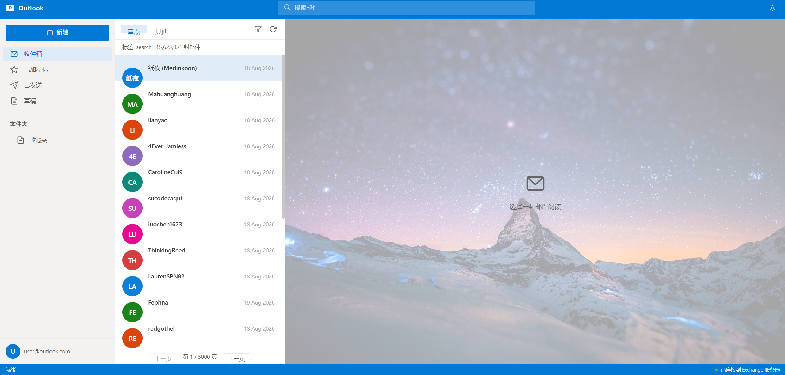

# Outlook Reader — AO3 隐身阅读器

> 把 AO3（Archive of Our Own）伪装成 Microsoft Outlook 界面的浏览器扩展。
> 打开 AO3 任意页面，看到的是一套完整的 Outlook 邮件客户端——搜索、列表、阅读，一应俱全。



## 这是什么

一个 Edge/Chrome 扩展（Manifest V3）。安装后，**访问 archiveofourown.org 的任意页面会自动变成 Outlook 界面**，所有 AO3 功能被"翻译"成邮件功能：

| Outlook 元素 | 实际功能 |
|---|---|
| 顶部搜索框 | AO3 作品搜索 |
| 左侧文件夹 | 收件箱=最新更新 / 已加星标=热门 / 已发送=长文 / 草稿=高点赞 / 收藏夹=分类浏览 |
| 邮件列表 | 搜索结果列表（作者、标题、字数、阅读数、评级） |
| 阅读区 | 小说正文（含作者笔记、后记、上下章导航） |
| 用户头像 | 跳转 AO3 登录页 |

界面目标参考（真实 Outlook Web）：


---

## 安装方法

### 方式一：手动加载（推荐）

1. 把本项目下载/解压到本地文件夹（例如 `D:\extensions\ao3-outlook-reader-extension`）
2. 打开 Edge 浏览器，地址栏输入 `edge://extensions/`
3. 打开左下角 **「开发人员模式」** 开关
4. 点击 **「加载解压缩的扩展」**
5. 选择包含 `manifest.json` 的那个文件夹

> 注意：浏览器安全策略要求未签名扩展必须开启开发人员模式，这是 Chrome/Edge 的强制限制。

### 方式二：启动脚本

项目内附带了 `启动Outlook Reader.bat` / `启动Outlook Reader.ps1`（Windows）。
双击脚本会自动用 `--load-extension` 参数启动 Edge 并打开 AO3。

```powershell
# PowerShell 启动脚本原理
$extDir = Join-Path $PSScriptRoot "."
Start-Process "msedge.exe" -ArgumentList "--load-extension=`"$extDir`"", "https://archiveofourown.org"
```

首次使用仍需手动开启一次开发人员模式。

---

## 使用说明

### 基本浏览

| 操作 | 方法 |
|---|---|
| 打开收件箱 | 点击左侧「收件箱」（加载最新更新的作品） |
| 搜索作品 | 顶部搜索框输入关键词，回车 |
| 查看正文 | 点击中间列表中的任意条目 |
| 翻页 | 列表底部「上一页 / 下一页」 |
| 浏览分类 | 左侧「收藏夹」→ 按媒体类型浏览 |
| 切换热门/最新 | 列表顶部「重点 / 其他」标签 |
| 刷新 | 列表右上角刷新按钮 |

### 搜索技巧

搜索框直接使用 AO3 搜索语法：

```
哈利波特                    # 关键词搜索
维克托 words:>1000          # 按字数过滤
勇利 complete:true          # 只看完结文
维勇 sort:hits              # 按热度排序
```

### 阅读界面

- 阅读区顶部显示：作品标题、作者、fandom、标签（含评级）、字数/章节/Kudos/阅读数
- 正文上方显示作者笔记（黄色区块），下方显示后记
- 多章节作品底部有「上一章 / 下一章」导航
- 底部按钮：
  - **收藏** — 打开 AO3 收藏页
  - **Kudos** — 打开原始页面点赞
  - **评论** — 跳转作品评论区
  - **原文** — 新标签打开 AO3 原始页面

### 成人内容（NSFW）确认页

遇到 AO3 的成人内容确认页时，会显示 Outlook 风格的提示卡片：
- **「是，继续」** — 同意查看，本次会话不再询问（AO3 会记住 cookie）
- **「不，返回」** — 返回上一页

### 登录页

点击左下角用户头像（`user@outlook.com`），会打开 AO3 登录页——同样被套壳成 Outlook 风格的登录卡片，表单直接提交到 AO3，登录后 AO3 功能正常使用（点赞、评论、收藏）。

### 查看原始页面

任何页面 URL 后追加 `?view=raw` 即可看到 AO3 原始界面（也是排障开关）：
```
https://archiveofourown.org/works/34500952?view=raw
```
右上角齿轮图标 = 一键切换回原始页面。

---

## 项目结构

```
ao3-outlook-reader-extension/
├── manifest.json          # MV3 扩展配置
├── content.js             # 主页面套壳逻辑（三栏布局 + 内容解析）
├── login.js               # 登录页套壳
├── outlook.css            # Outlook 风格样式（全站注入）
├── bg.jpg                 # 阅读区空态背景（夜空山脉）
├── icons/                 # 扩展图标
├── screenshots/           # 界面截图
└── README.md
```

### 工作原理

1. `manifest.json` 声明 content script 匹配 `archiveofourown.org/*`
2. 页面加载时注入 `outlook.css` + `content.js`，构建全屏 Outlook 覆盖层（`z-index` 最高）
3. 根据 URL 路由：`/` → 收件箱、`/works/search` → 邮件列表、`/works/:id` → 阅读区、`/media` → 分类浏览
4. 解析当前页面的 AO3 DOM，把数据渲染到 Outlook 对应区域
5. 所有导航通过整页跳转，扩展每页自动重新套壳

---

## 常见问题

**Q: 为什么必须开开发人员模式？**
浏览器安全机制不允许未签名扩展绕过。要免开发者模式只能上架 Edge Add-ons Store（需微软开发者账号 + 审核）。

**Q: 会泄露浏览记录吗？**
不会。所有请求直接发给 AO3，数据在本地浏览器处理，不经过任何第三方服务器。

**Q: 地址栏还能看到 archiveofourown.org 吗？**
能看到，浏览器不允许扩展隐藏地址栏。建议配合 Edge 全屏模式（F11）使用。

**Q: 某些页面显示空白？**
页面 JS 未加载完时偶发，刷新即可。若持续空白，用 `?view=raw` 检查原始页面是否正常，然后反馈。

**Q: 可以修改界面尺寸吗？**
可以。所有尺寸集中在 `outlook.css` 顶部的 CSS 变量（`--blue`、`--bg-app` 等）和各区域固定值，按需调整。

---

## 免责声明

- 本扩展仅为个人学习与技术探索用途，与微软（Microsoft）和 OTW/AO3 均无任何关联
- "Outlook" 为微软商标，本扩展仅做界面风格模仿
- 请遵守 AO3 服务条款，尊重创作者权益
- 数据全部在本地浏览器中处理

## License

MIT
